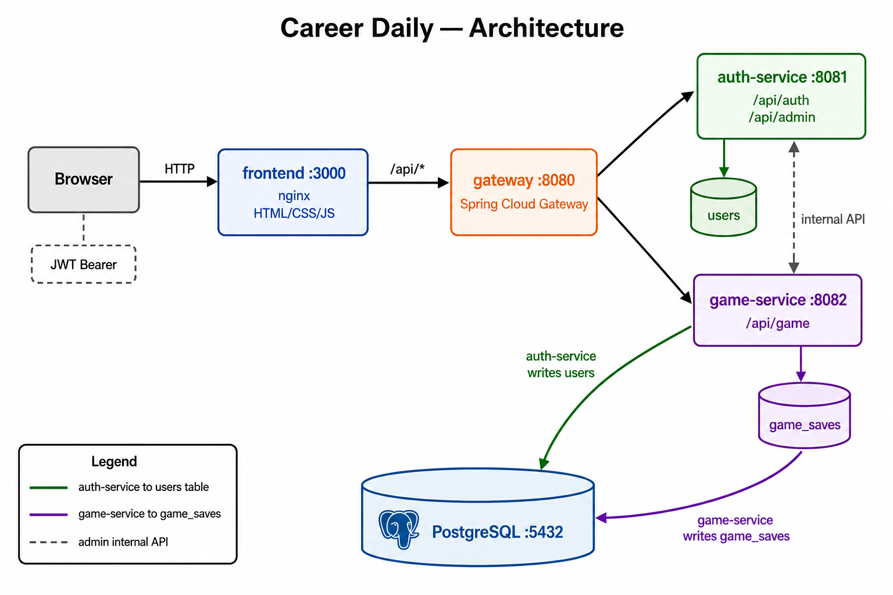
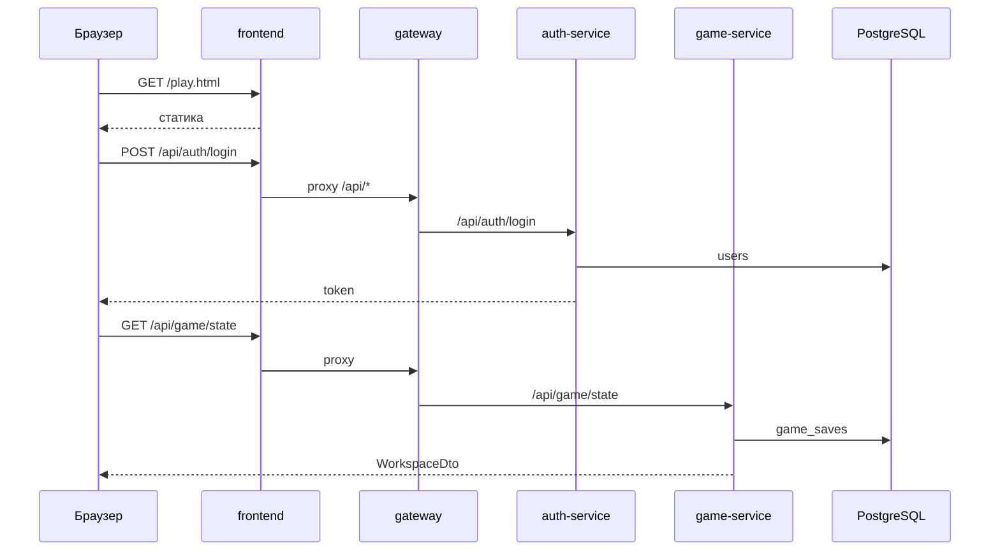

# Архитектура



Вектор: [`docs/architecture.svg`](docs/architecture.svg)

```
Браузер → frontend (nginx) → gateway → auth-service / game-service → PostgreSQL
JWT в заголовке Authorization: Bearer
```

`auth-service` — таблица `users`. `game-service` — `game_saves`. Одна БД, без FK между сервисами.

## Запросы



## Модули

| Каталог | Порт | Назначение |
|---------|------|------------|
| `frontend/` | 3000 | HTML, CSS, JS; прокси `/api` на gateway |
| `gateway/` | 8080 | Маршрутизация `/api/auth/**`, `/api/game/**` |
| `auth-service/` | 8081 | Регистрация (логин/пароль, капча), логин, админка |
| `game-service/` | 8082 | Движок, сохранения |
| `common/` | — | JWT, фильтры |

## Docker

```bash
docker compose up -d --build
```

- UI: http://localhost:3000
- Gateway: http://localhost:8080
- Postgres: порт 5433 на хосте

Переменные окружения — `.env.example`.

## Локально без Docker

```powershell
.\scripts\start-local.ps1
```

H2 в `./data/`, frontend на :3000, gateway на :8080.

С Postgres на хосте: `scripts/create-db.ps1`, профиль `postgres` в сервисах.

## База данных

Flyway в каждом сервисе своя история:

- `flyway_auth_history` — миграции auth-service (`users`, …)
- `flyway_game_history` — game-service (`game_saves`, …)

Сброс:

```bash
docker compose down -v
docker compose up -d --build
```

Только история Flyway (таблицы на месте):

```bash
docker exec career-daily-db psql -U devsimulator -d devsimulator -c "DROP TABLE IF EXISTS flyway_auth_history, flyway_game_history;"
docker compose restart auth-service game-service
```

## Регистрация (auth-service)

1. `POST /api/auth/register` — логин, пароль, имя в игре, капча, согласия 152-ФЗ
2. Вход — `POST /api/auth/login` по логину и паролю

Восстановление пароля не предусмотрено. Удаление аккаунта — `DELETE /api/auth/account`.
